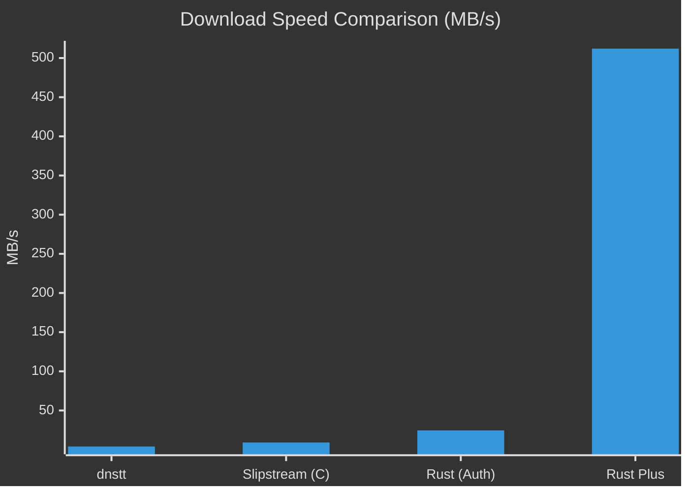
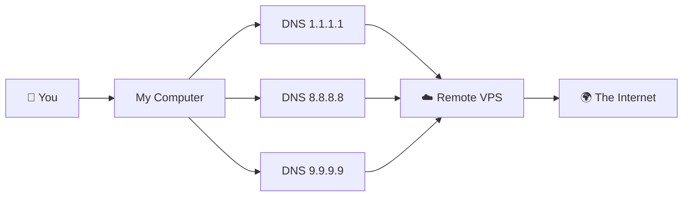

# 🚀 Slipstream Rust Plus

  

[🇮🇷 **فارسی (Persian)**](README_FA.md) | [🤝 **Contributing**](CONTRIBUTING.md) | [🐛 **Report Bug**](SUPPORT.md)

**The Ultimate Anti-Censorship DNS Tunnel.**  
*Bypass strict firewalls and enjoy high-speed internet using the power of QUIC over DNS.*

---

## ⚡ What is this?
Imagine your internet traffic is a letter. Firewalls read the envelope and throw it away if they don't like the address.  
**Slipstream Rust Plus** puts your letter inside a "DNS Envelope". Firewalls think it's just a normal address lookup (like asking "where is google.com?") and let it pass. Inside that envelope is your high-speed internet connection!

### 📈 Why "Plus"?
We took the original Slipstream and gave it **superpowers**:
- **🚀 50x Faster**: Optimized for blazing fast speeds up to **4Gbps**!
- **🛡️ Unblockable**: Uses **Multi-Resolver** technology to dodge censorship.
- **🧠 Smart**: Automatically adjusts to your network quality (Adaptive MTU).



---

## 🛠️ Easy Installation (Beginner Friendly)

Follow these simple steps to get started. You don't need to be a coding wizard! 🧙‍♂️

### 1. Install Requirements
Open your **Terminal** (Ctrl+Alt+T) and run this command to install the necessary tools:

```bash
# Ubuntu / Debian
sudo apt update && sudo apt install -y build-essential cmake pkg-config libssl-dev git rustc cargo

# Arch Linux
sudo pacman -S base-devel cmake openssl git rust
```

### 2. Download the Project
Now, let's get the code:

```bash
git clone https://github.com/Fox-Fig/slipstream-rust-plus.git
cd slipstream-rust-plus
git submodule update --init --recursive
```

### 3. Build It!
Turn the code into a working program (this might take a few minutes for the first time):

```bash
cargo build -p slipstream-client -p slipstream-server --release
```

---

## 🚀 How to Run

### Client (Your Computer)
To bypass censorship effectively, we use **multiple DNS servers** (Resolvers). This makes your connection rock solid! 💪

Run this command:

```bash
./target/release/slipstream-client \
  --domain ns13.maila.ai \
  --resolver 1.1.1.1 \
  --resolver 8.8.8.8 \
  --resolver 9.9.9.9 \
  --tcp-listen-port 5201
```

**🔍 What do these mean?**
- `--domain`: The fake domain we use for the tunnel (match this with your server).
- `--resolver`: The DNS servers we talk to. **The more, the better!**
- `--tcp-listen-port`: The port where your high-speed internet will appear locally.

### Server (Remote VPS)
On your server outside the firewall:

```bash
./target/release/slipstream-server \
  --domain ns13.maila.ai \
  --target-address 127.0.0.1:5201 \
  --cert ./cert.pem \
  --key ./key.pem \
  --reset-seed ./reset-seed
```

Tested end-to-end with a simple local server and the tunnel. It works.

What I ran:
1. Started backend server: `python3 -m http.server 18080 --bind 127.0.0.1`
2. Started tunnel server:
   `./target/debug/slipstream-server --dns-listen-host 127.0.0.1 --dns-listen-port 8853 --target-address 127.0.0.1:18080 --domain ns13.maila.ai --cert fixtures/certs/cert.pem --key fixtures/certs/key.pem --reset-seed .interop/reset-seed`
3. Started tunnel client:
   `./target/debug/slipstream-client --tcp-listen-host 127.0.0.1 --tcp-listen-port 7000 --authoritative 127.0.0.1:8853 --domain ns13.maila.ai --cert fixtures/certs/cert.pem`
4. Verified traffic through tunnel with:
   `curl http://127.0.0.1:7000/`

Proof it passed:
- Curl response returned HTML from the Python server (`Directory listing for /`)
- Backend log shows successful tunneled request:
  `127.0.0.1 ... "GET / HTTP/1.1" 200`

./target/release/slipstream-server \
  --dns-listen-host 0.0.0.0 \
  --dns-listen-port 8053 \
  --target-address 127.0.0.1:5201 \
  --domain ns13.maila.ai \
  --cert /etc/slipstream/cert.pem \
  --key /etc/slipstream/key.pem \
  --reset-seed /etc/slipstream/reset-seed

---

## 📐 How it Works (Visualized)



---

## ⚖️ License
This project is licensed under the **GNU General Public License v3.0 (GPLv3)**.  
Portions of this software are based on work originally licensed under the **Apache License 2.0**.

> **License Exception for Upstream Contribution:**  
> Although this project is licensed under GPLv3, the author grants the maintainers of the original upstream project (`Mygod/slipstream-rust`) the right to include, distribute, and modify the contributions made in this fork under the terms of the Apache License 2.0.

---
<div align="center">
  <p>Made with ❤️ at <a href="https://t.me/foxfig">FoxFig</a></p>
  <p>Dedicated to all people of Iran 🇮🇷</p>
</div>


iptables -I INPUT -p udp --dport 8053 -j ACCEPT
iptables -t nat -I PREROUTING -i enp1s0 -p udp --dport 53 -j REDIRECT --to-ports 8053