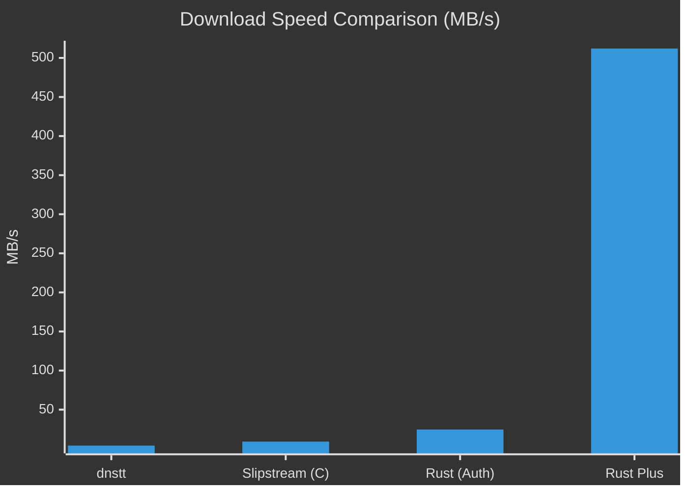
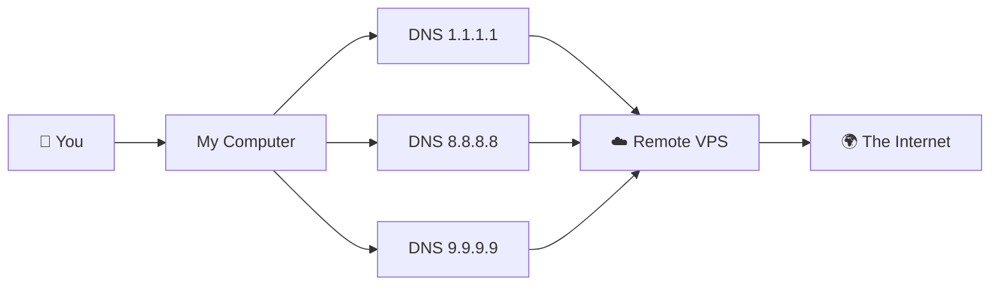

# 🚀 Slipstream Rust Plus

  

[🇮🇷 **فارسی (Persian)**](README_FA.md) | [🤝 **Contributing**](CONTRIBUTING.md) | [🐛 **Report Bug**](SUPPORT.md)

**The Ultimate Anti-Censorship DNS Tunnel.**  
*Bypass strict firewalls and enjoy high-speed internet using the power of QUIC over DNS.*

---

## ⚡ What is this?
Imagine your internet traffic is a letter. Firewalls read the envelope and throw it away if they don't like the address.  
**Slipstream Rust Plus** puts your letter inside a "DNS Envelope". Firewalls think it's just a normal address lookup (like asking "where is google.com?") and let it pass. Inside that envelope is your high-speed internet connection!

### 📈 Why "Plus"?
We took the original Slipstream and gave it **superpowers**:
- **🚀 50x Faster**: Optimized for blazing fast speeds up to **4Gbps**!
- **🛡️ Unblockable**: Uses **Multi-Resolver** technology to dodge censorship.
- **🧠 Smart**: Automatically adjusts to your network quality (Adaptive MTU).



---

## 🛠️ Easy Installation (Beginner Friendly)

Follow these simple steps to get started. You don't need to be a coding wizard! 🧙‍♂️

### 1. Install Requirements
Open your **Terminal** (Ctrl+Alt+T) and run this command to install the necessary tools:

```bash
# Ubuntu / Debian
sudo apt update && sudo apt install -y build-essential cmake pkg-config libssl-dev git rustc cargo

# Arch Linux
sudo pacman -S base-devel cmake openssl git rust
```

### 2. Download the Project
Now, let's get the code:

```bash
git clone https://github.com/Fox-Fig/slipstream-rust-plus.git
cd slipstream-rust-plus
git submodule update --init --recursive
```

### 3. Build It!
Turn the code into a working program (this might take a few minutes for the first time):

```bash
cargo build -p slipstream-client -p slipstream-server --release
```

---

## 🚀 How to Run

### Client (Your Computer)
To bypass censorship effectively, we use **multiple DNS servers** (Resolvers). This makes your connection rock solid! 💪

Run this command:

```bash
./target/release/slipstream-client \
  --domain ns13.maila.ai \
  --resolver 1.1.1.1 \
  --resolver 8.8.8.8 \
  --resolver 9.9.9.9 \
  --tcp-listen-port 5201
```

**🔍 What do these mean?**
- `--domain`: The fake domain we use for the tunnel (match this with your server).
- `--resolver`: The DNS servers we talk to. **The more, the better!**
- `--tcp-listen-port`: The port where your high-speed internet will appear locally.

### Server (Remote VPS)
On your server outside the firewall:

```bash
./target/release/slipstream-server \
  --domain ns13.maila.ai \
  --target-address 127.0.0.1:5201 \
  --cert ./cert.pem \
  --key ./key.pem \
  --reset-seed ./reset-seed
```

Tested end-to-end with a simple local server and the tunnel. It works.
python3 -m http.server 18080 --bind 127.0.0.1
What I ran:
1. Started backend server: `python3 -m http.server 18080 --bind 127.0.0.1`
2. Started tunnel server:
   `./target/release/slipstream-server --dns-listen-host 127.0.0.1 --dns-listen-port 8853 --target-address 127.0.0.1:18080 --domain ns13.maila.ai --cert fixtures/certs/cert.pem --key fixtures/certs/key.pem --reset-seed .interop/reset-seed`
3. Started tunnel client:
   `./target/release/slipstream-client --tcp-listen-host 127.0.0.1 --tcp-listen-port 7000 --authoritative 127.0.0.1:8853 --domain ns13.maila.ai --cert fixtures/certs/cert.pem`
4. Verified traffic through tunnel with:
   `curl http://127.0.0.1:9090/`

Proof it passed:
- Curl response returned HTML from the Python server (`Directory listing for /`)
- Backend log shows successful tunneled request:
  `127.0.0.1 ... "GET / HTTP/1.1" 200`

./target/release/slipstream-server \
  --dns-listen-host 0.0.0.0 \
  --dns-listen-port 8053 \
  --target-address 127.0.0.1:5201 \
  --domain ns13.maila.ai \
  --cert /etc/slipstream/cert.pem \
  --key /etc/slipstream/key.pem \
  --reset-seed /etc/slipstream/reset-seed

---

## 📐 How it Works (Visualized)



---

## ⚖️ License
This project is licensed under the **GNU General Public License v3.0 (GPLv3)**.  
Portions of this software are based on work originally licensed under the **Apache License 2.0**.

> **License Exception for Upstream Contribution:**  
> Although this project is licensed under GPLv3, the author grants the maintainers of the original upstream project (`Mygod/slipstream-rust`) the right to include, distribute, and modify the contributions made in this fork under the terms of the Apache License 2.0.

---
<div align="center">
  <p>Made with ❤️ at <a href="https://t.me/foxfig">FoxFig</a></p>
  <p>Dedicated to all people of Iran 🇮🇷</p>
</div>


iptables -I INPUT -p udp --dport 5300 -j ACCEPT
iptables -t nat -I PREROUTING -i enp1s0 -p udp --dport 53 -j REDIRECT --to-ports 5300


**Key Findings**
1. Current transport is effectively `TXT`-only. client response decode also accepts only `TXT` answers.
`A` is currently used as a negative-test / fallback classifier. Server decode rejects non-`TXT` now we need to find a wat to transport data using other record types.


4. Base32 is hardwired for QNAME payload encode/decode ([lib.rs:28](\/home\/slipstream-rust-plus\/crates\/slipstream-dns\/src\/lib.rs:28), [codec.rs:123](\/home\/slipstream-rust-plus\/crates\/slipstream-dns\/src\/codec.rs:123), [base32.rs:25](\/home\/slipstream-rust-plus\/crates\/slipstream-dns\/src\/base32.rs:25)).
5. Important existing constraint: client MTU is derived from QNAME capacity, so current EDNS0 path is practically unreachable with base32 ([runtime.rs:76](\/home\/slipstream-rust-plus\/crates\/slipstream-client\/src\/runtime.rs:76), [lib.rs:70](\/home\/slipstream-rust-plus\/crates\/slipstream-dns\/src\/lib.rs:70), [runtime.rs:517](\/home\/slipstream-rust-plus\/crates\/slipstream-client\/src\/runtime.rs:517)).

**All Steps Needed For Your Feature**
1. Define a transport-record abstraction (`enum` + capabilities + priority order by payload size) in DNS types, instead of single `RR_TXT` constants ([types.rs:3](\/home\/slipstream-rust-plus\/crates\/slipstream-dns\/src\/types.rs:3)).
2. Implement per-record RDATA encode/decode in codec (query accept + response parse), not TXT-only chunking ([codec.rs:247](\/home\/slipstream-rust-plus\/crates\/slipstream-dns\/src\/codec.rs:247), [codec.rs:313](\/home\/slipstream-rust-plus\/crates\/slipstream-dns\/src\/codec.rs:313)).
3. Add base64 module and replace base32 in QNAME build/decode paths ([lib.rs:19](\/home\/slipstream-rust-plus\/crates\/slipstream-dns\/src\/lib.rs:19), [codec.rs:112](\/home\/slipstream-rust-plus\/crates\/slipstream-dns\/src\/codec.rs:112)).
4. Recompute max payload math for base64 expansion in `max_payload_len_for_domain`; expected QNAME payload gain is ~20% vs base32.
5. Add probing state to resolver runtime (selected record, candidates, failures, timeout progression) in resolver state ([resolver.rs:20](\/home\/slipstream-rust-plus\/crates\/slipstream-client\/src\/dns\/resolver.rs:20)).
6. Update client send paths to use currently selected record type for data and polls ([runtime.rs:517](\/home\/slipstream-rust-plus\/crates\/slipstream-client\/src\/runtime.rs:517), [poll.rs:100](\/home\/slipstream-rust-plus\/crates\/slipstream-client\/src\/dns\/poll.rs:100)).
7. Update response handling so successful decode confirms/locks the record type; timeout/error triggers next candidate ([response.rs:28](\/home\/slipstream-rust-plus\/crates\/slipstream-client\/src\/dns\/response.rs:28)).
8. Keep server fully multi-record aware so it can answer whichever candidate record the client probes with ([server.rs:580](\/home\/slipstream-rust-plus\/crates\/slipstream-server\/src\/server.rs:580)).
9. Rework fallback tests that assume `RR_A` means “not transport DNS” ([udp_fallback.rs:481](\/home\/slipstream-rust-plus\/crates\/slipstream-server\/src\/udp_fallback.rs:481), [udp_fallback_e2e.rs:77](\/home\/slipstream-rust-plus\/crates\/slipstream-server\/tests\/udp_fallback_e2e.rs:77)).
10. Update vectors + generator to new schema/modes (current generator is base32/TXT-oriented) ([gen_vectors.c:9](\/home\/slipstream-rust-plus\/tools\/vector_gen\/gen_vectors.c:9), [gen_vectors.c:281](\/home\/slipstream-rust-plus\/tools\/vector_gen\/gen_vectors.c:281), [vectors.txt:16](\/home\/slipstream-rust-plus\/tools\/vector_gen\/vectors.txt:16), [fixtures README](\/home\/slipstream-rust-plus\/fixtures\/vectors\/README.md:5)).
11. Extend CLI/SIP003 config to allow candidate-record set and optional forced record ([main.rs:28](\/home\/slipstream-rust-plus\/crates\/slipstream-client\/src\/main.rs:28), [lib.rs:26](\/home\/slipstream-rust-plus\/crates\/slipstream-ffi\/src\/lib.rs:26)).
12. Update protocol/docs for base64 + probing + multi-record behavior ([protocol.md:3](\/home\/slipstream-rust-plus\/docs\/protocol.md:3), [dns-codec.md:7](\/home\/slipstream-rust-plus\/docs\/dns-codec.md:7), [profiling.md:17](\/home\/slipstream-rust-plus\/docs\/profiling.md:17)).

Critical design warning: plain RFC4648 base64 in QNAME is case-sensitive; DNS names are case-insensitive in transit, so recursive resolvers can corrupt payload unless you constrain mode or encoding strategy.


Two practical options (excluding `TXT`) with the best compatibility profile are:

1. `A` / `AAAA` response channel (recommended)
- How: keep sending upstream data in `QNAME`; return downstream data in many `A` (4-byte chunks) or `AAAA` (16-byte chunks) RRs.
- Compatibility: highest in real-world DNS paths, because `A` and `AAAA` are core, universally deployed types.
- Tradeoff: smaller payload per RR than `TXT`; needs chunking/reassembly logic.

2. `CNAME` response channel
- How: encode downstream data into the CNAME target domain labels.
- Compatibility: generally good, but lower than `A/AAAA` due CNAME-specific behavior/rules.
- Tradeoff: stricter DNS semantics (CNAME owner cannot carry other data), and name-based encoding can be mangled by relays.

Important compatibility caveat for your base64 plan:
- **Inference from standards + operational docs:** plain case-sensitive base64 in DNS names is risky, because DNS label matching is case-insensitive and some relays normalize case. Prefer a DNS-safe alphabet (or put raw bytes in RDATA types like `A/AAAA` where possible).

If you want max bandwidth (not max compatibility):
- `NULL` / private RR types can carry more, but are much less reliable through public recursive resolvers.

Sources:
- RFC 1035 (A, CNAME, NULL formats): https://www.rfc-editor.org/rfc/rfc1035  
- RFC 3596 (AAAA, compatibility intent): https://datatracker.ietf.org/doc/html/rfc3596  
- RFC 2181 (CNAME constraints): https://www.rfc-editor.org/rfc/rfc2181  
- RFC 4343 (DNS case-insensitivity): https://datatracker.ietf.org/doc/html/rfc4343  
- iodine operational compatibility notes (record-type tradeoffs, relay behavior): https://github.com/yarrick/iodine  
- dnstt survey (cross-tool record-type usage observations): https://www.bamsoftware.com/software/dnstt/survey.html


```bash
 ./target/release/slipstream-server --dns-listen-host 0.0.0.0 --dns-listen-port 5300 --target-address 127.0.0.1:8080 --domain ns13.maila.ai --cert /etc/slipstream/cert.pem --key /etc/slipstream/key.pem --reset-seed /etc/slipstream/reset-seed 
 ```


Port 53 udp redirects to 5300 using iptable rules. 


./target/release/slipstream-client --domain ns13.maila.ai --resolver 8.8.8.8 --tcp-listen-port 5300


Yes, I tested, but not the exact public-recursive setup you pasted (`8.8.8.8/9.9.9.9` + your external server).  
I tested local end-to-end and full workspace CI checks.

**Reproducible Summary (what I ran)**
1. `cargo build --workspace`  
- Result: PASS

2. `cargo test --workspace`  
- Result: PASS (all unit/integration/e2e/doc tests)

3. `cargo clippy --workspace --all-targets -- -D warnings`  
- Result: PASS

4. Local tunnel e2e (same flow as your README example)  
- Backend: `python3 -m http.server 18080 --bind 127.0.0.1`  
- Server: `./target/debug/slipstream-server --dns-listen-host 127.0.0.1 --dns-listen-port 8853 --target-address 127.0.0.1:18080 --domain ns13.maila.ai --cert fixtures/certs/cert.pem --key fixtures/certs/key.pem --reset-seed .interop/reset-seed`  
- Client: `./target/debug/slipstream-client --tcp-listen-host 127.0.0.1 --tcp-listen-port 7000 --authoritative 127.0.0.1:8853 --domain ns13.maila.ai --cert fixtures/certs/cert.pem`  
- Verify: `curl http://127.0.0.1:7000/`  
- Result: PASS (`Directory listing for /` returned; backend logged `GET / ... 200`)

Artifacts:
- [e2e_backend.log](/home/slipstream-rust-plus/.interop/e2e_backend.log)
- [e2e_tunnel_server.log](/home/slipstream-rust-plus/.interop/e2e_tunnel_server.log)
- [e2e_tunnel_client.log](/home/slipstream-rust-plus/.interop/e2e_tunnel_client.log)
- [e2e_curl.out](/home/slipstream-rust-plus/.interop/e2e_curl.out)

**Important**
- I did **not** validate your exact production topology with public recursive resolvers.
- Your pasted run uses recursive mode (`--resolver 8.8.8.8`) while your server listens on `8053`; that requires proper authoritative delegation + reachable UDP/53 path (or correct redirect/NAT) for `ns13.maila.ai`. Without that, disconnect loops like your log are expected.


dig @95.179.201.6 ns13.maila.ai A


1. **Observations**
- Background: this repo is a DNS tunnel (`slipstream-client`/`slipstream-server`) and you recently moved transport away from TXT toward another RR type (now `AAAA` in code changes).
- Your current test intent is resolver-path sanity (`--resolver 8.8.8.8`), not direct authoritative mode.
- Your DNS data currently shows `n13.maila.ai A 95.179.201.6` resolves on public recursors.
- `ns13.maila.ai NS` via public recursors has returned `NXDOMAIN` in repeated checks.
- Host-side networking is mostly in place: `slipstream-server` listens on `:5300/udp`, and `iptables` redirect `53 -> 5300` is active (counters increment).
- Local server queries to `127.0.0.1:5300` for `ns13.maila.ai` returned `NXDOMAIN`.
- Clarification: there is likely a naming/type mismatch in checks (`n13` vs `ns13`, and `A` checks while transport now expects `AAAA` behavior).

2. **Problem:**
Problem: Resolver-mode tunnel validation is failing because the externally tested DNS name/type path does not consistently match the server’s authoritative zone and expected query type, causing `NXDOMAIN` despite network redirection working.

3. **Goal:**
Goal: Make one canonical resolver path work end-to-end by aligning (1) delegated domain name, (2) server `--domain`, and (3) expected RR type (`AAAA`), then validating with recursors (`8.8.8.8`) using those exact aligned values.